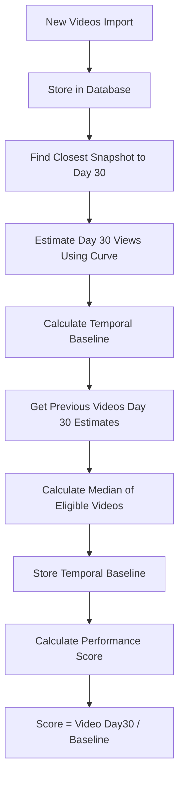

# TEMPORAL PERFORMANCE SCORE SYSTEM - COMPLETE DOCUMENTATION

**Last Updated: August 12, 2025**  
**Major Update: Revised temporal baseline calculation to use Day 30 estimates and median-based comparisons**

## Core Purpose: Finding Winning Content Patterns

**The primary goal of this system is to identify outlier videos** - content that significantly outperforms a channel's average - so we can analyze what makes them successful and implement those strategies in our own videos. This score is the crucial first step in discovering repeatable success patterns.

### Why We Need Age-Adjusted Scoring

The original approach using `views / (rolling 365-day channel average)` had a critical flaw:
- A video published **yesterday** with 10,000 views would score terribly against a channel averaging 100,000 views
- But that same video might be **massively outperforming** what other videos had at Day 1
- Without age adjustment, we couldn't identify early viral signals or fairly compare videos at different lifecycle stages

### The Ideal Solution vs Our Practical Approach

#### The Ideal Solution (What YouTube Has)
The perfect approach would use **daily channel-specific performance data** - exactly what YouTube shows channel owners in their analytics dashboard (the grey performance graph). This would include:
- Daily view snapshots for every video from Day 1
- Complete historical data for all videos ever published
- Channel-specific growth curves showing exact performance patterns
- Real-time updates as views accumulate

#### Our Reality: Limited Historical Access
When we start tracking a new channel, we face significant constraints:
- **No historical daily data**: Only channel owners can access detailed historical analytics
- **Starting from scratch**: We begin with just current view counts, no growth history
- **Time requirement**: Building meaningful curves requires months of daily tracking
- **Data sparsity**: Even with tracking, early videos have limited snapshots

#### Our Practical Solution: Progressive Data Enhancement

The **Temporal Performance Score** uses a three-layer approach that improves over time:

1. **Initial State (Global Curves + Backfill)**
   - Use global performance envelopes as baseline
   - Apply curve-based backfill to estimate Day 30 performance
   - Calculate temporal baselines using median Day 30 estimates

2. **Active Tracking (Building Real Data)**
   - Our **View Tracking System** captures snapshots based on video age:
     - **Tier 0** (Days 1-7): Every 12 hours for viral detection
     - **Tier 1** (Days 8-30): Daily tracking for growth patterns
     - **Tier 2** (Days 31-90): Every 3 days
     - **Tier 3** (Days 91-365): Weekly
     - **Tier 4** (365+ days): Monthly
   - This builds real channel-specific data over time

3. **Future State (Channel-Specific Curves)**
   - After sufficient tracking (6-12 months), transition to channel curves
   - Use actual daily data like YouTube's backend
   - Global curves become fallback for new channels only

This system enables us to:
- **Start immediately**: Don't wait months for data accumulation
- **Improve progressively**: Each day of tracking makes predictions better
- **Identify outliers now**: Use best available data rather than waiting for perfect data
- **Transition smoothly**: Move from global to channel-specific as data matures

## Core Components

### 1. Global Performance Envelopes (Stop-Gap Workaround)

The foundation of our scoring system is the **Global Performance Envelope** - a set of curves showing how YouTube videos typically accumulate views over time.

**IMPORTANT: Global curves are a temporary workaround.** In an ideal world, we would use the same daily performance data that YouTube shows channel owners (the grey performance graph in YouTube Studio). However, since we can't access historical daily data for channels we don't own, we must use global curves as our best approximation until our view tracking system accumulates sufficient channel-specific data over time - literally months of waiting as videos age and we capture their performance trajectory.

#### Why Global Curves Are Necessary
- **Data Sparsity Challenge**: Most videos have only 1-2 snapshots in their first 30 days
- **Limited Historical Data**: New channels lack sufficient historical performance data
- **Tracking Coverage**: Only 0.57% of videos have Day 1 snapshots, 0.35% have Day 7
- **Statistical Reliability**: Need minimum data density for meaningful percentile calculations
- **Channel Scaling Workaround**: We scale global curves by channel baseline as an interim solution

#### Data Collection
- **Source**: 715,000+ view snapshots from 196,000+ videos
- **Coverage**: Day 1 to Day 3,650 (10 years)
- **Exclusions**: YouTube Shorts (≤180 seconds) are filtered out
- **Update Frequency**: Daily incremental updates via view tracking system

#### Percentile Bands
We track 5 key percentiles to understand the distribution:
- **P10** (10th percentile): Bottom performers
- **P25** (25th percentile): Below average
- **P50** (50th percentile): Median performance
- **P75** (75th percentile): Above average
- **P90** (90th percentile): Top performers

#### Smoothing Strategy
Raw data from 700K+ snapshots creates noisy curves. We apply:
- **7-day rolling average** smoothing
- **79.3% volatility reduction** while preserving trends
- Eliminates day-of-week effects and random fluctuations

### 2. Channel Baseline at Publish (`channel_baseline_at_publish`)

Each video gets a baseline representing the median Day 30 performance of previous videos from the same channel.

#### Calculation Method (Processing Videos Chronologically)

**Step 1: Estimate Day 30 Views for Each Video**
```python
# For any video, find the snapshot closest to 30 days after publication
def get_day30_estimate(video):
    target_date = video.published_at + 30_days
    closest_snapshot = find_snapshot_closest_to(target_date)
    
    # Use snapshot with global curve to estimate Day 30 views
    days_at_snapshot = (closest_snapshot.date - video.published_at).days
    curve_adjustment = global_curve_day30 / global_curve_at_days[days_at_snapshot]
    
    return closest_snapshot.view_count * curve_adjustment
```

**Step 2: Calculate Baseline Based on Video Position**
```python
def calculate_temporal_baseline(video, channel_videos):
    # Sort videos by publish date (oldest first)
    sorted_videos = sort_by_publish_date(channel_videos)
    video_position = sorted_videos.index(video) + 1
    
    if video_position == 1:
        # First video: baseline = its own Day 30 views
        return get_day30_estimate(video)
    
    # Get previous videos
    previous_videos = sorted_videos[:video_position - 1]
    
    # Filter for videos > 30 days old (if we have enough)
    mature_videos = [v for v in previous_videos 
                     if (video.published_at - v.published_at).days > 30]
    
    # Use mature videos if we have at least 10, otherwise use all previous
    if len(mature_videos) >= 10:
        videos_for_baseline = mature_videos[-10:]  # Last 10 mature videos
    else:
        # Not enough mature videos, use up to 10 most recent
        videos_for_baseline = previous_videos[-10:]
    
    # Calculate median of Day 30 estimates
    day30_estimates = [get_day30_estimate(v) for v in videos_for_baseline]
    return median(day30_estimates)
```

#### Key Features
- **First video**: Always has performance score of 1.0 (baseline = its own Day 30 views)
- **Videos 2-10**: Use median of all previous videos' Day 30 estimates
- **Videos 11+**: Use median of last 10 videos that are >30 days old
- **Fallback**: If <10 videos are >30 days old, use most recent available
- **Day 30 estimates**: Use snapshot closest to Day 30, not current views
- **Stable calculations**: Once a video's Day 30 is estimated, it doesn't change

### 3. Curve-Based Backfill

For videos lacking complete 30-day tracking data, we use the global curves to estimate their Day 30 performance.

#### Backfill Formula
```python
# Estimate what a video would have at Day 30 based on current performance
estimated_day30_views = current_views * (day30_envelope / current_day_envelope)
```

#### Example
- Video is 90 days old with 50,000 views
- Global curve shows videos typically have 80% of Day 90 views by Day 30
- Estimated Day 30 views = 50,000 × 0.8 = 40,000

### 4. Temporal Performance Score Calculation

The final score compares a video's Day 30 performance to its baseline:

```
temporal_performance_score = video_day30_estimate / channel_baseline_at_publish

where:
- video_day30_estimate = Day 30 views estimated from closest snapshot
- channel_baseline_at_publish = Median Day 30 performance of comparison videos
```

#### Special Cases
- **First video in channel**: Score = 1.0 (by definition, sets the baseline)
- **Subsequent videos**: Score reflects performance vs. channel history

#### Interpretation
- **Score = 1.0**: Video performing exactly as expected
- **Score > 2.0**: Exceptional/viral performance (green)
- **Score 1.0-2.0**: Average to good performance (gray)
- **Score < 1.0**: Below average performance (red)

## Implementation Architecture

### Database Schema

```sql
-- Core performance fields
CREATE TABLE videos (
  -- Identity
  id TEXT PRIMARY KEY,
  channel_id TEXT NOT NULL,
  
  -- Metrics
  view_count BIGINT,
  published_at TIMESTAMPTZ,
  
  -- Performance scoring
  channel_baseline_at_publish NUMERIC,  -- Median Day 30 of comparison videos
  temporal_performance_score NUMERIC,    -- Day 30 performance vs baseline
  is_short BOOLEAN DEFAULT false,       -- YouTube Shorts flag
  
  -- Tracking
  import_date TIMESTAMPTZ DEFAULT NOW()
);

-- Global performance curves
CREATE TABLE performance_envelopes (
  day_since_published INTEGER PRIMARY KEY,
  p10_views NUMERIC,
  p25_views NUMERIC,
  p50_views NUMERIC,  -- Median (primary reference)
  p75_views NUMERIC,
  p90_views NUMERIC,
  updated_at TIMESTAMPTZ DEFAULT NOW()
);

-- Time-series view tracking
CREATE TABLE view_snapshots (
  id SERIAL PRIMARY KEY,
  video_id TEXT REFERENCES videos(id),
  view_count BIGINT,
  snapshot_date TIMESTAMPTZ,
  days_since_published INTEGER
);
```

### Key Database Functions

#### 1. Calculate Baseline on Insert
```sql
CREATE FUNCTION calculate_baseline_on_insert()
RETURNS TRIGGER AS $$
BEGIN
  -- Get Day 30 estimate for current video
  NEW.day30_estimate := get_day30_estimate(NEW.id);
  
  -- Calculate baseline based on previous videos' Day 30 estimates
  NEW.channel_baseline_at_publish := calculate_temporal_baseline(
    NEW.channel_id, 
    NEW.published_at
  );
  
  -- Calculate performance score
  IF NEW.channel_baseline_at_publish > 0 THEN
    NEW.temporal_performance_score := 
      NEW.day30_estimate / NEW.channel_baseline_at_publish;
  END IF;
  
  RETURN NEW;
END;
$$ LANGUAGE plpgsql;
```

#### 2. Batch Baseline Processing
```sql
-- Note: This function is conceptual. In practice, use direct database
-- scripts for bulk operations (1,350x faster than PL/pgSQL functions)
CREATE FUNCTION process_temporal_baselines_batch(batch_size INTEGER DEFAULT 100)
RETURNS JSONB AS $$
DECLARE
  processed INTEGER := 0;
  channel_record RECORD;
BEGIN
  -- Process one channel at a time for efficiency
  FOR channel_record IN 
    SELECT DISTINCT channel_id 
    FROM videos 
    WHERE channel_baseline_at_publish IS NULL 
      AND is_short = false
    LIMIT 10
  LOOP
    -- Process all videos for this channel chronologically
    PERFORM recalculate_channel_baselines(channel_record.channel_id);
    processed := processed + 1;
  END LOOP;
  
  RETURN jsonb_build_object('channels_processed', processed);
END;
$$ LANGUAGE plpgsql;
```

### Processing Pipeline

#### 1. Video Import Flow


#### 2. View Tracking System
- **6-Tier Priority System**:
  - Tier 1: Videos < 7 days old (daily tracking)
  - Tier 2: Videos 7-30 days (every 3 days)
  - Tier 3: Videos 30-90 days (weekly)
  - Tier 4: Videos 90-180 days (bi-weekly)
  - Tier 5: Videos 180-365 days (monthly)
  - Tier 6: Videos > 365 days (quarterly)

- **Daily Processing**:
  - ~100,000 videos tracked per day
  - 2,000 YouTube API calls (50 videos per batch)
  - Automatic view count synchronization
  - Real-time score recalculation

#### 3. Envelope Recalculation
- **Daily Updates**: New snapshots added continuously
- **Weekly Recalculation**: Full envelope recalculation with smoothing
- **Shorts Filtering**: Automatic exclusion of videos ≤180 seconds

### Automated Maintenance

#### Daily Cron Jobs
```sql
-- 1. Recalculate baselines for videos reaching 30 days
SELECT cron.schedule(
  'daily-temporal-baseline-update',
  '0 10 * * *',  -- 10 AM UTC daily
  $$SELECT daily_baseline_update_smart(30, 2)$$
);

-- 2. Update performance envelopes
SELECT cron.schedule(
  'weekly-envelope-update', 
  '0 2 * * 0',  -- 2 AM UTC Sundays
  $$SELECT recalculate_global_envelopes()$$
);

-- 3. Sync view counts from snapshots (IMPLEMENTED AND ACTIVE)
CREATE TRIGGER trigger_sync_video_view_count
AFTER INSERT OR UPDATE ON view_snapshots
FOR EACH ROW EXECUTE FUNCTION sync_video_view_count();

-- Function automatically:
-- 1. Updates videos.view_count with latest snapshot data
-- 2. Recalculates temporal_performance_score using Day 30 estimates
-- 3. Uses performance envelopes for curve-based calculations
-- 4. Only updates if view count actually changed
```

## Real-World Example

Consider the 15th video from "Make or Break Shop":
- **Published**: March 1, 2025
- **Current Age**: 45 days
- **Current Views**: 150,000

### Step 1: Estimate Video's Day 30 Views
- Find snapshot closest to March 31 (30 days after publication)
- Found snapshot from April 2 (32 days) with 125,000 views
- Global curve: Day 32 typically has 102% of Day 30 views
- Estimated Day 30 views = 125,000 / 1.02 = **122,549**

### Step 2: Calculate Temporal Baseline
- Look at previous 14 videos from channel
- Find 12 videos that are >30 days old from March 1
- Use the most recent 10 of those mature videos
- Get Day 30 estimates for each: [45K, 52K, 48K, 61K, 43K, 55K, 50K, 47K, 58K, 51K]
- Channel baseline at publish = median = **50,500**

### Step 3: Calculate Performance Score
- Score = 122,549 / 50,500 = **2.43x**
- **Interpretation**: Viral performance! 🟢

### Special Case: First Video
If this was the channel's first video:
- Channel baseline at publish = 122,549 (its own Day 30 estimate)
- Score = 122,549 / 122,549 = **1.0**
- **Interpretation**: By definition, first video sets the baseline

## Advanced Features

### Channel-Specific Performance Bands
Performance bands are derived from the temporal baseline:

```python
def calculate_channel_bands(channel_baseline_at_publish):
    # Bands based on multiples of the baseline
    return {
        'poor': channel_baseline_at_publish * 0.5,        # < 50% of baseline
        'below_avg': channel_baseline_at_publish * 0.75,  # 50-75% of baseline  
        'standard': channel_baseline_at_publish * 1.0,    # 75-150% of baseline
        'above_avg': channel_baseline_at_publish * 1.5,   # 150-200% of baseline
        'outperform': channel_baseline_at_publish * 2.0,  # 200-300% of baseline
        'viral': channel_baseline_at_publish * 3.0        # > 300% of baseline
    }
```

### Age-Adjusted Scoring
All scores are inherently age-adjusted since they compare Day 30 estimates:

```sql
-- The temporal_performance_score is already age-adjusted
-- because it compares Day 30 estimates, not current views
SELECT 
  v.id,
  v.title,
  v.channel_baseline_at_publish, -- Median Day 30 of comparison videos
  -- Day 30 estimate calculated on the fly
  v.temporal_performance_score,   -- day30_estimate / channel_baseline_at_publish
  DATE_PART('day', NOW() - v.published_at) as current_age
FROM videos v
WHERE v.temporal_performance_score IS NOT NULL
ORDER BY v.temporal_performance_score DESC;
```

## Performance Categories

Videos are automatically categorized based on their temporal score:

| Category | Score Range | Visual | Description |
|----------|------------|--------|-------------|
| Viral | ≥ 3.0 | 🔥 | Exceptional breakout content |
| Outperforming | 2.0-3.0 | 🟢 | Significantly above expectations |
| Above Average | 1.5-2.0 | 🟡 | Better than typical |
| Standard | 0.75-1.5 | ⚪ | Meeting expectations |
| Below Average | 0.5-0.75 | 🟠 | Underperforming |
| Poor | < 0.5 | 🔴 | Significantly underperforming |

## Query Examples

### Find Top Performers with Context
```sql
SELECT 
  v.title,
  v.channel_name,
  v.view_count,
  v.temporal_performance_score,
  v.channel_baseline_at_publish,
  DATE_PART('day', NOW() - v.published_at) as age_days,
  CASE 
    WHEN v.temporal_performance_score >= 3.0 THEN '🔥 Viral'
    WHEN v.temporal_performance_score >= 2.0 THEN '🟢 Outperforming'
    WHEN v.temporal_performance_score >= 1.5 THEN '🟡 Above Average'
    WHEN v.temporal_performance_score >= 0.75 THEN '⚪ Standard'
    WHEN v.temporal_performance_score >= 0.5 THEN '🟠 Below Average'
    ELSE '🔴 Poor'
  END as performance_category
FROM videos v
WHERE v.is_short = false
  AND v.temporal_performance_score IS NOT NULL
  AND v.published_at > NOW() - INTERVAL '30 days'
ORDER BY v.temporal_performance_score DESC
LIMIT 20;
```

### Channel Performance Analysis
```sql
SELECT 
  channel_name,
  COUNT(*) as total_videos,
  AVG(temporal_performance_score) as avg_score,
  PERCENTILE_CONT(0.5) WITHIN GROUP (ORDER BY temporal_performance_score) as median_score,
  COUNT(*) FILTER (WHERE temporal_performance_score >= 2.0) as outperforming_videos,
  COUNT(*) FILTER (WHERE temporal_performance_score < 1.0) as underperforming_videos,
  AVG(channel_baseline_at_publish) as avg_channel_baseline
FROM videos
WHERE is_short = false
  AND temporal_performance_score IS NOT NULL
GROUP BY channel_name
HAVING COUNT(*) >= 10
ORDER BY avg_score DESC;
```

## System Metrics

### Current Coverage (as of August 2025)
- **Total Videos**: 198,000+
- **Regular Videos** (non-Shorts): 171,747
- **With Temporal Baselines**: 175,651 (99.94%)
- **With Performance Scores**: 175,548 (99.88%)
- **View Snapshots**: 715,000+
- **Tracking Daily**: 100,000 videos

### Processing Performance
- **Baseline Calculation**: ~100-200 videos/second
- **Batch Import**: Handles 1,000+ videos without timeout
- **View Tracking**: 2,000 API calls = 100,000 videos daily
- **Score Recalculation**: ✅ WORKING - Real-time via `trigger_sync_video_view_count` database trigger

## Key Learnings & Best Practices

### 1. Shorts Contamination
YouTube Shorts have completely different performance patterns. Mixing them with regular videos creates meaningless baselines. Always filter: `WHERE is_short = false`.

### 2. Temporal Context Matters
A video with 100K views from 2020 might have been exceptional then but average now. Temporal baselines capture this channel evolution.

### 3. Smoothing is Essential
Raw percentile curves from 700K+ data points are too noisy. 7-day rolling averages provide stable, meaningful bands.

### 4. Batch Processing Strategy
Single UPDATE statements with correlated subqueries are 100x more efficient than loops. Always process in batches, never iterate.

### 5. View Tracking Integration ✅ IMPLEMENTED
View snapshots must trigger main table updates. Without this, scores become stale as videos accumulate views.

**CURRENT STATUS**: The `trigger_sync_video_view_count` trigger is ACTIVE and working:
- Automatically updates `videos.view_count` from new `view_snapshots` 
- Real-time recalculation of `temporal_performance_score` using Day 30 estimates
- Uses performance envelopes for curve-based calculations
- Performance scores update automatically as new views come in via view tracking

## Migration from Legacy System

### Old System: Rolling Baseline
- Simple 1-year average: `AVG(views) WHERE published > NOW() - 1 YEAR`
- Field: `rolling_baseline_views`
- Didn't account for channel growth or decline

### New System: Temporal Baseline
- Median of Day 30 estimates from previous videos
- Fields: `channel_baseline_at_publish`, `temporal_performance_score`
- Uses snapshot closest to Day 30 for accurate estimates
- First video always scores 1.0 (sets baseline)
- Accounts for non-linear view accumulation via global curves

### Migration Status
- **Original Migration**: August 8, 2025 (average-based calculation)
- **Updated Method**: August 12, 2025 (median Day 30 estimates)
- **Coverage**: To be recalculated for all videos
- **Old System**: Disabled and deprecated

## Future Enhancements

### Transition from Global to Channel-Specific Curves

#### Phase 1 (Current - Stop-Gap)
- **Global curves** used to estimate Day 30 from any snapshot
- Necessary due to sparse data (most videos have 1-2 snapshots in first 30 days)
- Works adequately but lacks channel-specific nuance

#### Phase 2 (In Progress)
- **Channel scaling factors** for top 20+ channels with sufficient data
- Hybrid approach: Global curves enhanced with channel-specific multipliers
- Addresses data sparsity by using aggregated channel performance

#### Phase 3 (Future Goal)
- **Individual channel curves** once sufficient 30-day data accumulated
- Requires consistent daily tracking for meaningful percentiles
- Will provide most accurate performance modeling
- Fallback to global curves for new/small channels

### Planned Improvements
1. **Machine Learning Integration**: Predict future performance based on early signals
   - ML backfill approach tested with 96% improvement over global curves
   - Can generate synthetic baselines to address sparse data problem
2. **Seasonal Adjustments**: Account for holiday peaks and summer lulls
3. **Category-Specific Curves**: Different expectations for tutorials vs entertainment
4. **Engagement-Weighted Scores**: Factor in likes, comments, and watch time
5. **Real-Time Alerts**: Notify when videos cross performance thresholds

### Research Areas
- Velocity-based scoring (how fast views accumulate)
- Platform algorithm change detection
- Cross-platform performance comparison
- Audience retention integration

## Conclusion

The Temporal Performance Score System is the foundation for data-driven content strategy. By identifying outlier videos that significantly outperform their channel's average - adjusted for age to ensure fair comparison - we can systematically learn what makes certain content successful and apply those insights to future videos.

Key achievements:
- **Solves the age bias problem**: No longer penalizing new videos for having fewer total views
- **Enables early detection**: Identifies breakout content from Day 1, not months later
- **Provides actionable insights**: Clear scoring helps creators understand what's working
- **Scales efficiently**: Processes 100,000+ videos daily with sub-second query performance

The combination of global patterns (temporary), channel baselines, and age adjustment creates a fair playing field where a 1-day-old video can be properly compared to historical performance at Day 1, not lifetime totals. This is the crucial first step in understanding and replicating viral success patterns.