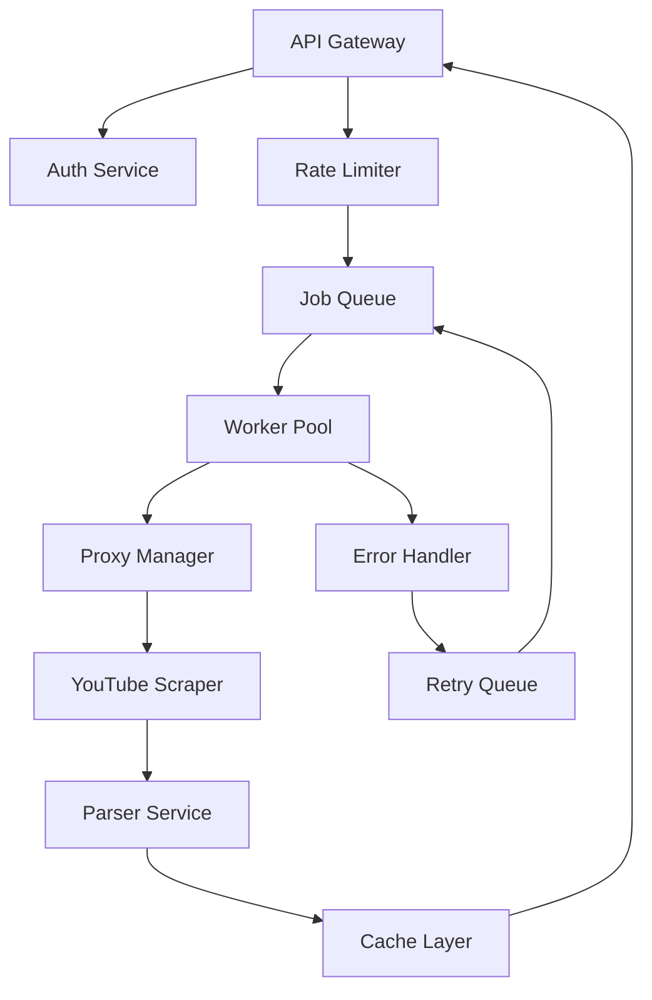

# Building a Supadata Clone - Architecture Overview

## Core System Architecture



## Minimum Code Implementation

### 1. Proxy Manager (Most Complex Part)
```javascript
class ProxyManager {
  constructor() {
    this.proxies = [];
    this.bannedProxies = new Set();
    this.proxyStats = new Map();
  }

  async initializeProxies() {
    // Load from multiple providers
    this.proxies = await Promise.all([
      this.loadResidentialProxies(),
      this.loadDatacenterProxies(),
      this.loadMobileProxies()
    ]).flat();
  }

  async getHealthyProxy() {
    // Complex logic to:
    // - Track success rates per proxy
    // - Rotate based on usage patterns
    // - Avoid detection patterns
    // - Handle geographic distribution
    const candidates = this.proxies.filter(p => 
      !this.bannedProxies.has(p.ip) &&
      this.getSuccessRate(p) > 0.7 &&
      this.getLastUsed(p) > 30000 // 30 sec cooldown
    );

    return this.selectOptimalProxy(candidates);
  }

  handleProxyFailure(proxy, error) {
    // Track failures, ban if necessary
    // Implement exponential backoff
    // Alert if proxy pool is depleted
  }
}
```

### 2. YouTube Scraper with Anti-Detection
```javascript
class YouTubeScraper {
  async fetchTranscript(videoId, options = {}) {
    const maxRetries = 5;
    let lastError;

    for (let attempt = 0; attempt < maxRetries; attempt++) {
      const proxy = await this.proxyManager.getHealthyProxy();
      
      try {
        // Randomize request patterns
        await this.randomDelay();
        
        const response = await this.makeRequest(videoId, {
          proxy,
          headers: this.generateBrowserHeaders(),
          timeout: 30000
        });

        if (this.isRateLimited(response)) {
          await this.handleRateLimit(proxy);
          continue;
        }

        if (this.requiresCaptcha(response)) {
          await this.solveCaptcha(response);
          continue;
        }

        return this.parseTranscript(response);
        
      } catch (error) {
        lastError = error;
        await this.proxyManager.handleProxyFailure(proxy, error);
        
        // Exponential backoff
        await this.delay(Math.pow(2, attempt) * 1000);
      }
    }

    throw new Error(`Failed after ${maxRetries} attempts: ${lastError}`);
  }

  generateBrowserHeaders() {
    // Mimic real browser behavior
    return {
      'User-Agent': this.getRandomUserAgent(),
      'Accept': 'text/html,application/xhtml+xml,application/xml;q=0.9,*/*;q=0.8',
      'Accept-Language': 'en-US,en;q=0.5',
      'Accept-Encoding': 'gzip, deflate, br',
      'DNT': '1',
      'Connection': 'keep-alive',
      'Upgrade-Insecure-Requests': '1',
      'Sec-Fetch-Dest': 'document',
      'Sec-Fetch-Mode': 'navigate',
      'Sec-Fetch-Site': 'none',
      'Cache-Control': 'max-age=0'
    };
  }
}
```

### 3. Queue System for Scale
```javascript
class TranscriptQueue {
  constructor() {
    this.redis = new Redis();
    this.workers = [];
  }

  async addJob(videoId, userId, priority = 'normal') {
    const job = {
      id: uuid(),
      videoId,
      userId,
      priority,
      attempts: 0,
      createdAt: Date.now()
    };

    // Priority queue implementation
    const score = priority === 'high' ? 0 : Date.now();
    await this.redis.zadd('transcript:queue', score, JSON.stringify(job));
    
    return job.id;
  }

  async processJobs() {
    // Spawn workers based on load
    const optimalWorkerCount = await this.calculateOptimalWorkers();
    
    for (let i = 0; i < optimalWorkerCount; i++) {
      this.spawnWorker();
    }
  }

  async spawnWorker() {
    while (true) {
      const job = await this.redis.zpopmin('transcript:queue');
      if (!job) {
        await this.delay(1000);
        continue;
      }

      try {
        const result = await this.scraper.fetchTranscript(job.videoId);
        await this.storeResult(job.id, result);
        await this.updateCredits(job.userId);
        
      } catch (error) {
        await this.handleJobFailure(job, error);
      }
    }
  }
}
```

### 4. API Layer
```javascript
class TranscriptAPI {
  constructor() {
    this.app = express();
    this.setupMiddleware();
    this.setupRoutes();
  }

  setupMiddleware() {
    // Rate limiting per API key
    this.app.use(this.rateLimiter());
    
    // Authentication
    this.app.use(this.authenticateAPIKey());
    
    // Credit checking
    this.app.use(this.checkCredits());
  }

  setupRoutes() {
    this.app.post('/v1/youtube/transcript', async (req, res) => {
      try {
        const { videoUrl } = req.body;
        const videoId = this.extractVideoId(videoUrl);
        
        // Check cache first
        const cached = await this.cache.get(videoId);
        if (cached) {
          await this.deductCredits(req.user, 1);
          return res.json(cached);
        }

        // Add to queue
        const jobId = await this.queue.addJob(videoId, req.user.id);
        
        // Wait for completion (with timeout)
        const result = await this.waitForJob(jobId, 30000);
        
        await this.deductCredits(req.user, 1);
        res.json(result);
        
      } catch (error) {
        this.handleAPIError(error, res);
      }
    });
  }
}
```

## Infrastructure Requirements

### Servers
- **API Servers**: 2-3 instances (load balanced)
- **Worker Servers**: 5-10 instances (auto-scaling)
- **Cache/Redis**: Clustered setup
- **Database**: PostgreSQL with read replicas

### Proxy Infrastructure
```yaml
proxy_providers:
  residential:
    - provider: "BrightData"
      cost: "$500/month"
      ips: 10000
      success_rate: 0.95
    
  datacenter:
    - provider: "ProxyRack"  
      cost: "$200/month"
      ips: 5000
      success_rate: 0.75
      
  mobile:
    - provider: "Soax"
      cost: "$300/month"
      ips: 3000
      success_rate: 0.90
```

### Monitoring Stack
- **Metrics**: Prometheus + Grafana
- **Logging**: ELK Stack
- **Error Tracking**: Sentry
- **Uptime**: Pingdom/UptimeRobot

## Time & Cost Breakdown

### Development Time (1 Developer)
- **Week 1-2**: Basic transcript fetching
- **Week 3-4**: Proxy system & anti-detection
- **Week 5-6**: Queue system & scaling
- **Week 7-8**: API layer & billing
- **Week 9-10**: Testing & edge cases
- **Week 11-12**: Production deployment

**Total: 3 months for MVP**

### Monthly Operating Costs
- **Servers**: $300-500
- **Proxies**: $500-1000  
- **Database/Cache**: $200
- **Monitoring**: $100
- **Total**: $1,100-1,800/month

### Ongoing Maintenance
- **Weekly**: 10-15 hours
- **YouTube changes**: 20-40 hours per incident
- **Proxy management**: 5-10 hours/month
- **Customer support**: 10-20 hours/month

## Why Supadata is Worth $158

Building this yourself means:
1. **3 months development** (480 hours @ $100/hr = $48,000)
2. **$1,500/month infrastructure** 
3. **40 hours/month maintenance** ($4,000/month)
4. **Constant firefighting** when YouTube changes

Versus:
- **Supadata**: $158 total
- **Time to implement**: 2 hours
- **Maintenance**: Zero

The build vs buy decision here is clear - Supadata's pricing is essentially giving away the service to gain market share.